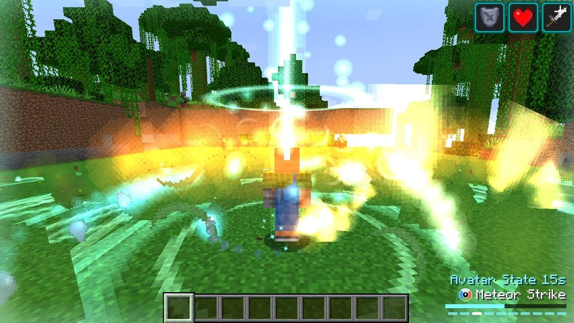
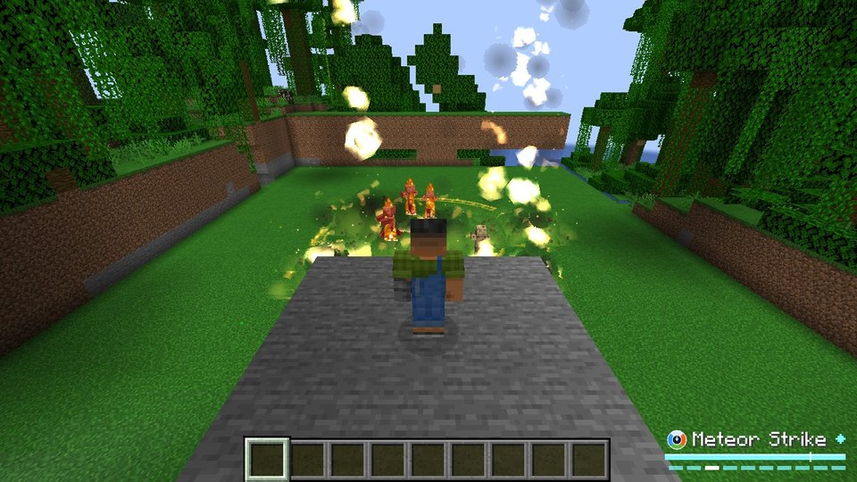
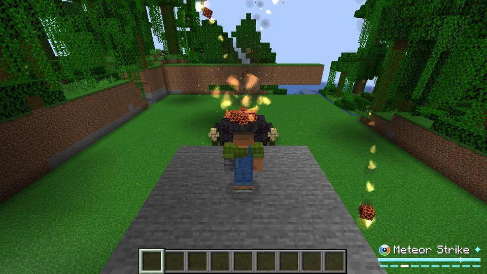
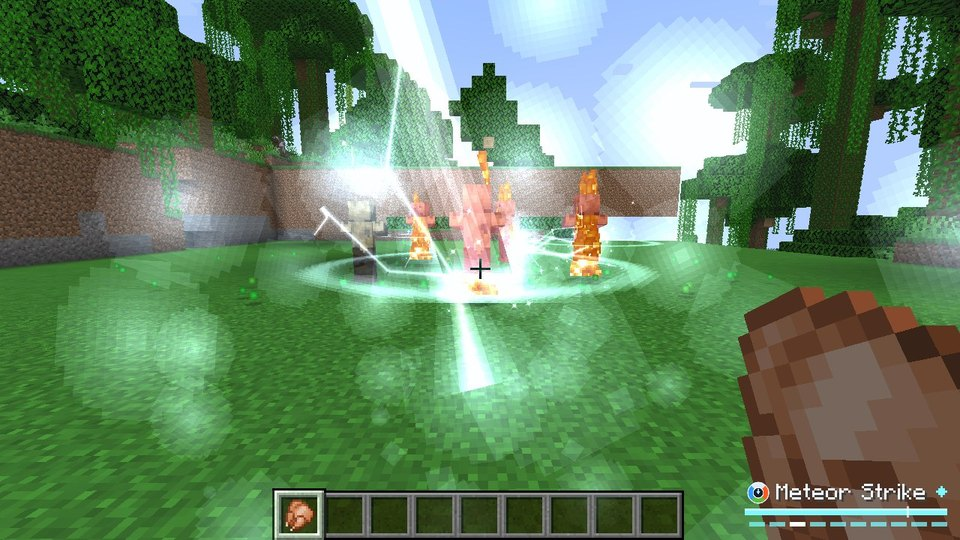
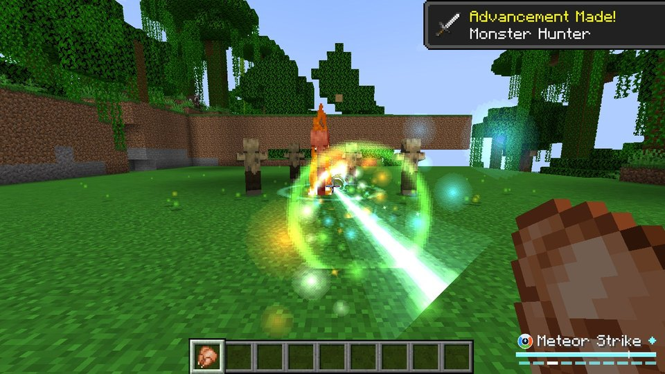
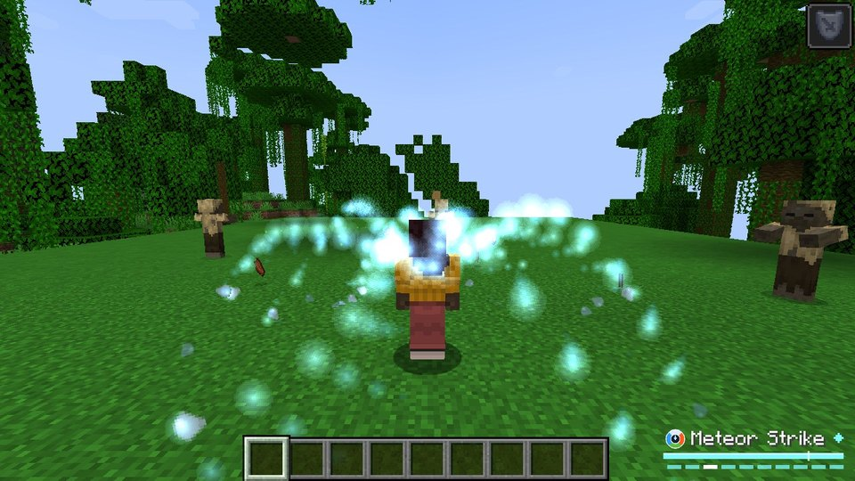
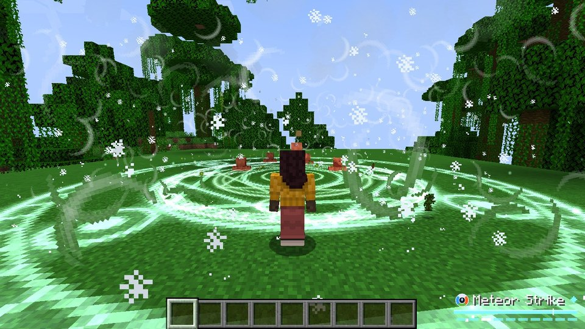
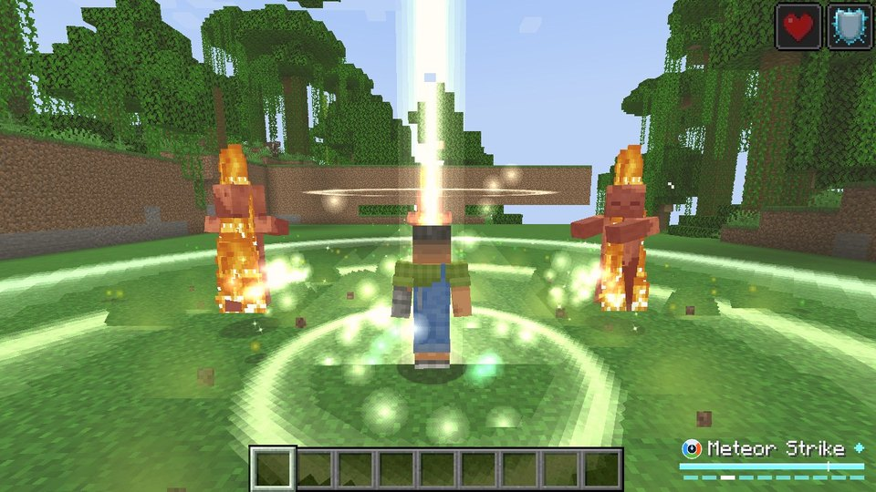
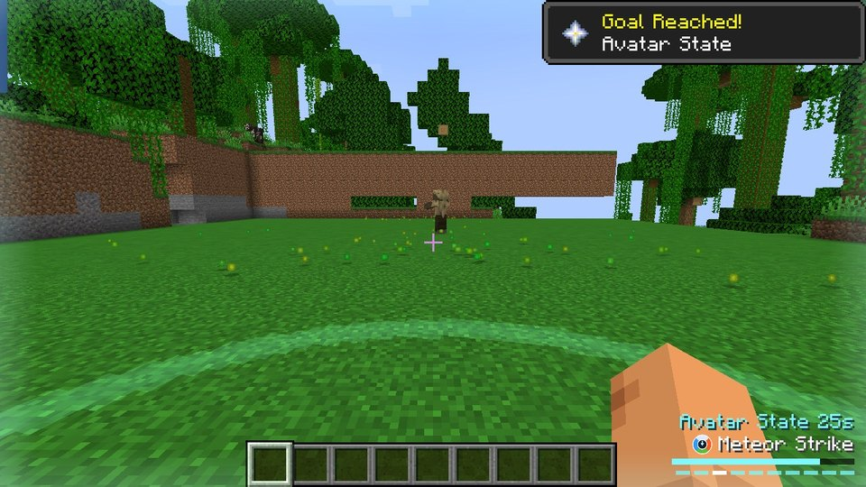

# Avatar Bending

A Minecraft mod inspired by *Avatar: The Last Airbender*. Choose Air, Water, Earth or Fire and unleash **50 bending spells**: 10 for each element plus 10 Avatar spells. Then craft the **Avatar Spirit** to master all four elements and enter the **Avatar State**.

**Minecraft 1.21.1 · Fabric · Fabric API required**

| | |
|---|---|
|  |  |
|  |  |
|  |  |
|  |  |
|  |  |
|  |  |
|  | |

## Download

Download [`release/AvatarBending-2.0.0-Fabric-1.21.1.zip`](release/AvatarBending-2.0.0-Fabric-1.21.1.zip). It contains the mod, Fabric API and install instructions.

## Install with SKLauncher

1. In SKLauncher, open **Installations → New installation**.
2. Under **Version**, choose **Fabric** and **1.21.1**, then click **Save**.
3. Open the zip, go to `overrides/mods/` and copy **both** `.jar` files into your `mods` folder:
   - Windows: `%appdata%\.minecraft\mods`
   - macOS: `~/Library/Application Support/minecraft/mods`
   - Linux: `~/.minecraft/mods`

   If the installation uses its own game directory, use the `mods` folder inside it.
4. Select the Fabric 1.21.1 installation and press **Play**.

**Updating from 1.0.0?** Delete the old `avatarbending-1.0.0.jar` from your `mods` folder first. Two copies of the mod stop the game from starting.

Launchers with an **Import modpack** option, such as SKLauncher 4, Prism Launcher, CurseForge and MultiMC, can import the zip directly. The zip has a CurseForge-style `manifest.json`.

## Controls

The keys can be changed in **Options → Controls → Key Binds → Avatar Bending**.

| Key | Action |
|---|---|
| **R** | Bend: use the selected spell |
| **G** | Next spell (**Shift+G** for the previous one) |
| **K** | Bending Scroll: browse all spells and click one to select it |
| **V** | Switch element (Avatar only) |
| **B** | Avatar State (Avatar only) |

A small HUD next to the hotbar shows:
- the selected spell, which turns gray while it recharges and red when you lack the chi;
- a slim **chi** bar, with a tick mark at the cost of the selected spell;
- one dot per spell: white for the selected one, dark while recharging.

Every spell costs chi, which refills by itself.

## Spells

| Air | Water | Earth | Fire | Avatar |
|---|---|---|---|---|
| Air Blast | Water Whip | Boulder Toss | Fire Blast | Elemental Storm |
| Air Barrage | Ice Shards | Rock Barrage | Fire Fists | Energybending |
| Air Blade | Ice Wave | Earth Spikes | Fire Whip | Meteor Strike |
| Air Leap | Glacier Bomb | Earth Wall | Fire Jet | Elemental Beam |
| Air Scooter | Healing Waters | Earth Pillar | Inferno Ring | Fire Tornado |
| Wind Shield | Water Spout | Metal Cables | Dragon Breath | Blizzard |
| Vacuum | Octopus Form | Earth Armor | Fire Dragon | Volcano |
| Air Sphere | Tidal Wave | Seismic Slam | Combustion | Spirit Form |
| Tornado | Bloodbending | Lavabending | Lightning | Raava's Light |
| Air Cannon | Maelstrom | Fissure | Firestorm | Avatar's Wrath |

Some highlights:
- **Air Cannon:** compresses the wind into a sonic blast that pierces everything in a 40-block line.
- **Vacuum:** sucks every mob into one point, then smashes them together.
- **Octopus Form:** eight water tentacles lash nearby mobs and swat projectiles out of the air.
- **Bloodbending:** lifts every creature nearby and slams it down. Stronger under a full moon.
- **Fissure:** tears the ground open under your enemies, then slams it shut. The ground always closes back.
- **Metal Cables:** zip to any block, or yank a mob to you.
- **Fire Dragon:** a serpent of fire that hunts the nearest enemy.
- **Lightning:** chains to up to three more enemies, and is even stronger in thunderstorms.
- **Firestorm:** burning meteors rain down on the area you aim at.
- **Spirit Form:** leave your body as a glowing spirit. You can fly and turn invisible, and mobs lose track of you.
- **Avatar's Wrath:** only in the Avatar State. You rise up and unleash waves of every element and bolts of lightning, ending in a cataclysm.

Hover over a spell in the Bending Scroll (**K**) to read what it does.

**Passive bonuses:**

| Element | Bonus |
|---|---|
| Air | No fall damage and extra speed |
| Water | Fast swimming and water breathing in water. Spells are stronger in water or rain. |
| Earth | Faster mining |
| Fire | Immune to fire and lava |

The Avatar gets all of them.

## Become the Avatar

Craft the **Avatar Spirit**:

```
            Breeze Rod
Heart of the Sea  Totem of Undying  Diamond Block
            Blaze Rod
```

Use it to unlock all four elements and the Avatar spells.

Press **B** to enter the **Avatar State** for 30 seconds, with a 2 minute cooldown. You rise inside a pillar of light while the four elements burst out around you. While it's active:
- You can fly.
- Your eyes glow and a four-element aura orbits you.
- The aura blasts away enemies that come close and turns back arrows and enemy bending.
- Spells are free, 75% stronger and recharge four times faster.

The Avatar State also awakens by itself when the Avatar is about to die.

## Effects and sound

- Every spell has its own glowing particle effects: light, flames, wind, water, ice, rock and lightning.
- Big spells shake the camera and flash the screen. Both follow the **Distortion Effects** and **Hide Lightning Flashes** accessibility settings.
- 22 sound effects were made for the mod and are layered with vanilla sounds.

## Commands

| Command | Who | What it does |
|---|---|---|
| `/bending choose <air\|water\|earth\|fire>` | Everyone | Pick your first element |
| `/bending info [player]` | Everyone | Show bending info |
| `/bending avatar [player]` | Operators | Become the Avatar instantly |
| `/bending state` | Operators | Enter the Avatar State now |
| `/bending set <player> <element>` | Operators | Change a player's element |
| `/bending reset [player]` | Operators | Remove bending |
| `/bending refill` | Operators | Refill chi and cooldowns |
| `/bending cast <spell> [player]` | Operators | Cast any spell for free (for command blocks and maps) |

## World safety

No spell destroys or steals blocks:
- **Explosions:** no terrain damage.
- **Lightning:** cosmetic, so it never starts fires.
- **Temporary terrain:** earth walls, spikes, pillars, ice, magma, the Volcano and the Fissure all sink back or close up after a few seconds. They never drop items when broken and are restored when the world closes.

## Building from source

Requires Java 21.

```
./gradlew build          # mod jar in build/libs/
./gradlew modpack        # SKLauncher zip in release/
./gradlew runGametest    # automated tests: every spell is cast at a test target
./gradlew prodClient     # play-test the release jar in a normal (non-dev) game
python3 tools/gen_textures.py    # regenerate the GUI textures
python3 tools/gen_particles.py   # regenerate the particle textures
python3 tools/gen_sounds.py      # regenerate the sound effects (needs numpy, scipy and ffmpeg)
```

---

This is an unofficial fan mod. It is not affiliated with or endorsed by Nickelodeon or the creators of *Avatar: The Last Airbender*. The code is MIT licensed. Fabric API is bundled under the Apache 2.0 license.
