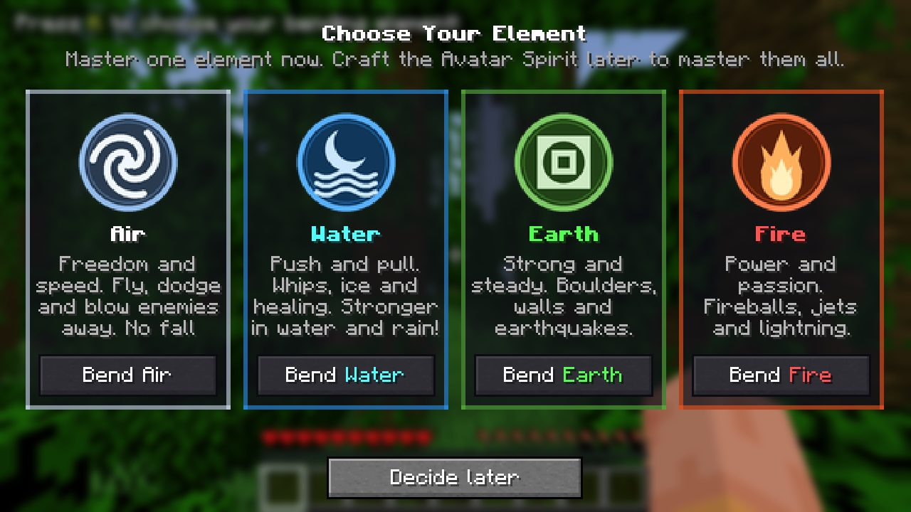
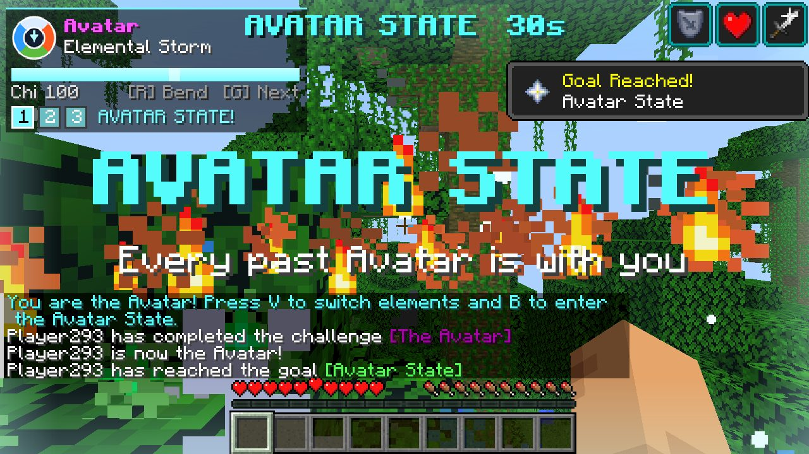
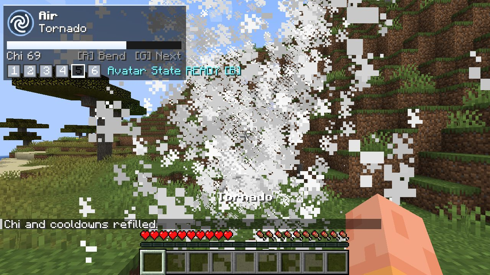
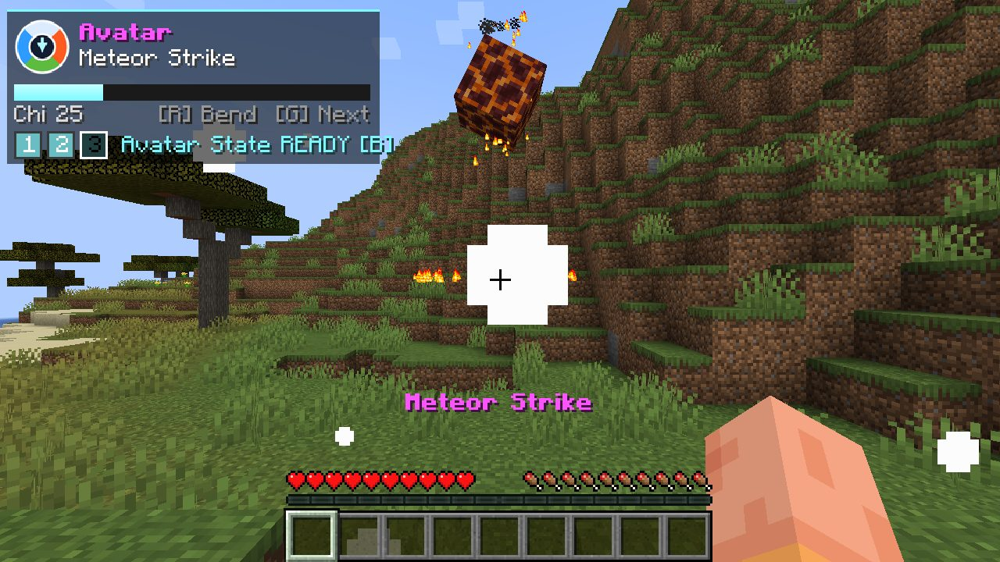
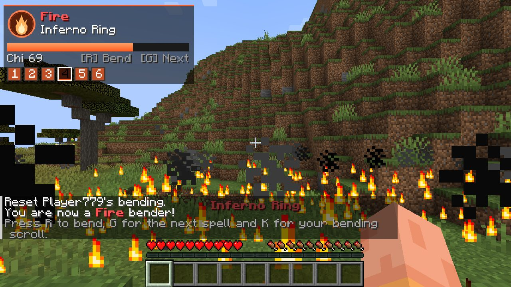
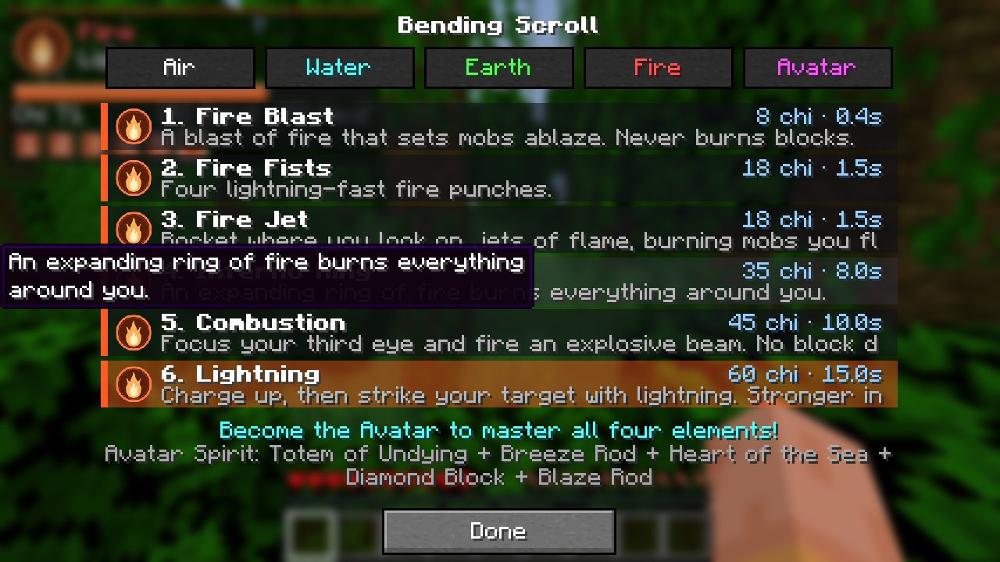

# Avatar Bending

A Minecraft mod inspired by *Avatar: The Last Airbender*. Choose Air, Water, Earth or Fire, unleash **27 bending spells**, then craft the **Avatar Spirit** to master all four elements and enter the **Avatar State**.

**Minecraft 1.21.1 · Fabric · Fabric API required**

| | |
|---|---|
|  |  |
|  |  |
|  |  |

## Download

Download [`release/AvatarBending-1.0.0-Fabric-1.21.1.zip`](release/AvatarBending-1.0.0-Fabric-1.21.1.zip). It contains the mod, Fabric API and install instructions.

## Install with SKLauncher

1. In SKLauncher, open **Installations → New installation**.
2. Under **Version**, choose **Fabric** and **1.21.1**, then click **Save**.
3. Open the zip, go to `overrides/mods/` and copy **both** `.jar` files into your `mods` folder:
   - Windows: `%appdata%\.minecraft\mods`
   - macOS: `~/Library/Application Support/minecraft/mods`
   - Linux: `~/.minecraft/mods`

   If the installation uses its own game directory, use the `mods` folder inside it.
4. Select the Fabric 1.21.1 installation and press **Play**.

Launchers with an **Import modpack** option, such as SKLauncher 4, Prism Launcher, CurseForge and MultiMC, can import the zip directly. The zip has a CurseForge-style `manifest.json`.

## Controls

The keys can be changed in **Options → Controls → Key Binds → Avatar Bending**.

| Key | Action |
|---|---|
| **R** | Bend: use the selected spell |
| **G** | Next spell (**Shift+G** for the previous one) |
| **K** | Bending Scroll: browse all spells and click one to select it |
| **V** | Switch element (Avatar only) |
| **B** | Avatar State (Avatar only) |

The top-left panel shows your element, the selected spell, your **chi** and the cooldown of each spell slot. Every spell costs chi, which refills by itself.

## Spells

| Air | Water | Earth | Fire |
|---|---|---|---|
| Air Blast | Water Whip | Boulder Toss | Fire Blast |
| Air Barrage | Ice Shards | Earth Spikes | Fire Fists |
| Air Leap | Ice Wave | Earth Wall | Fire Jet |
| Air Scooter | Healing Waters | Earth Pillar | Inferno Ring |
| Tornado | Water Spout | Seismic Slam | Combustion |
| Air Sphere | Tidal Wave | Earth Armor | Lightning |

**Avatar-only spells:** Elemental Storm, Energybending and Meteor Strike.

**Passive bonuses:**

| Element | Bonus |
|---|---|
| Air | No fall damage and extra speed |
| Water | Fast swimming and water breathing in water. Spells are stronger in water or rain. |
| Earth | Faster mining |
| Fire | Immune to fire and lava |

The Avatar gets all of them.

## Become the Avatar

Craft the **Avatar Spirit**:

```
            Breeze Rod
Heart of the Sea  Totem of Undying  Diamond Block
            Blaze Rod
```

Use it to unlock all four elements and the Avatar spells.

Press **B** to enter the **Avatar State** for 30 seconds, with a 2 minute cooldown. While it's active:
- You can fly.
- Your eyes and arrow tattoos glow.
- A four-element aura surrounds you.
- Spells are free, 75% stronger and recharge four times faster.

The Avatar State also awakens by itself when the Avatar is about to die.

## Commands

| Command | Who | What it does |
|---|---|---|
| `/bending choose <air\|water\|earth\|fire>` | Everyone | Pick your first element |
| `/bending info [player]` | Everyone | Show bending info |
| `/bending avatar [player]` | Operators | Become the Avatar instantly |
| `/bending state` | Operators | Enter the Avatar State now |
| `/bending set <player> <element>` | Operators | Change a player's element |
| `/bending reset [player]` | Operators | Remove bending |
| `/bending refill` | Operators | Refill chi and cooldowns |
| `/bending cast <spell> [player]` | Operators | Cast any spell for free (for command blocks and maps) |

## World safety

No spell destroys or steals blocks:
- **Explosions:** no terrain damage.
- **Lightning:** cosmetic, so it never starts fires.
- **Earth walls, spikes, pillars and ice:** temporary. They sink back after a few seconds, never drop items when broken, and are removed when the world closes.

## Building from source

Requires Java 21.

```
./gradlew build          # mod jar in build/libs/
./gradlew modpack        # SKLauncher zip in release/
./gradlew runGametest    # automated tests: every spell is cast at a test target
python3 tools/gen_textures.py   # regenerate the textures
```

---

This is an unofficial fan mod. It is not affiliated with or endorsed by Nickelodeon or the creators of *Avatar: The Last Airbender*. The code is MIT licensed. Fabric API is bundled under the Apache 2.0 license.
